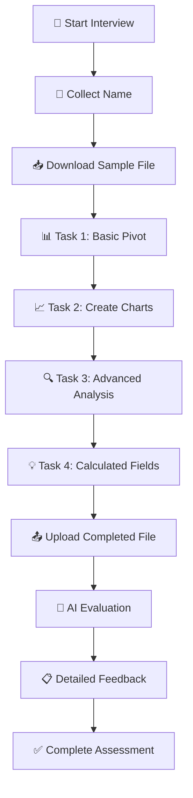

# 📊 Excel Interview Agent

**AI-Powered Excel Proficiency Assessment System**

[](https://python.org)
[](https://streamlit.io)
[](https://openai.com)
[](LICENSE)

An intelligent, automated interview system that evaluates candidates' Microsoft Excel skills through interactive tasks and real-time AI assessment. Built with OpenAI GPT-4, Streamlit, and Python.

## 📚 **Table of Contents**
- [🎬 Demo](#-demo)
- [🎯 Overview](#-overview)
- [✨ Key Features](#-key-features)
- [🚀 Quick Start](#-quick-start)
- [📁 Project Structure](#-project-structure)
- [🎓 How It Works](#-how-it-works)
- [🛠️ Configuration Options](#️-configuration-options)
- [📖 Usage Guide](#-usage-guide)
- [🎯 Assessment Details](#-assessment-details)
- [🔧 Advanced Features](#-advanced-features)
- [🐛 Troubleshooting](#-troubleshooting)
- [📊 API Reference](#-api-reference)
- [🤝 Contributing](#-contributing)
- [📞 Support](#-support)

---

## 🎬 **Demo**

### **Quick Demo Video**
*Coming Soon - Watch the Excel Interview Agent in action!*

### **Live Demo**
Try the system with sample data:
1. Run `python run_streamlit.py`
2. Open http://localhost:8501
3. Enter your name: "Demo User"
4. Download the sample file
5. Complete the Excel tasks
6. Upload your file for instant AI evaluation

### **Sample Assessment**
```
👤 Candidate: John Doe
📊 Overall Score: 87/100

📈 Breakdown:
• Technical Accuracy: 92/100 ✅
• Pivot Tables: 85/100 ✅  
• Visualization: 89/100 ✅
• Data Organization: 84/100 ✅
• Presentation: 88/100 ✅

💡 Key Strengths: Excellent formula usage, clean data presentation
🎯 Areas for Improvement: Advanced pivot table features
```

---

## 🎯 **Overview**

The Excel Interview Agent revolutionizes technical interviews by providing:
- **Automated Excel skill assessment** without human interviewer involvement
- **Interactive, conversational** evaluation experience
- **Real-time feedback** and detailed scoring
- **Standardized evaluation** across all candidates
- **Professional reporting** with comprehensive analysis

### **Who Is This For?**
- **HR Teams** looking to streamline Excel skill assessment
- **Technical Recruiters** needing consistent evaluation standards
- **Companies** hiring for data analysis, finance, or administrative roles
- **Educational Institutions** teaching Excel proficiency

---

## ✨ **Key Features**

### 🤖 **AI-Powered Interview**
- **Intelligent Conversation**: Natural language interaction with AI interviewer
- **Adaptive Questioning**: Dynamic follow-up based on candidate responses
- **Professional Tone**: Maintains interview standards and consistency

### 📋 **Comprehensive Assessment**
- **5 Core Excel Tasks**:
  1. **Data Download & Setup** - File handling and preparation
  2. **Pivot Table Creation** - Data summarization and analysis
  3. **Chart Visualization** - Data presentation and formatting
  4. **Advanced Analysis** - Complex formulas and functions
  5. **Calculated Fields** - Advanced pivot table features

### 📊 **Evaluation Criteria**
- **Technical Accuracy** (30 points) - Correct formulas and calculations
- **Pivot Tables & Analysis** (25 points) - Data summarization skills
- **Charts & Visualization** (20 points) - Presentation and formatting
- **Data Organization** (15 points) - Structure and readability
- **Professional Presentation** (10 points) - Overall quality

### 🌐 **Dual Interface Options**
- **Streamlit Web App** - Modern, interactive web interface
- **Command Line Interface** - Direct terminal interaction

### 📈 **Real-Time Features**
- **Progress Tracking** - Visual progress indicators
- **File Management** - Seamless upload/download process
- **Instant Evaluation** - Immediate AI-powered assessment
- **Session Management** - Persistent conversation history

---

## 🚀 **Quick Start**

### **Prerequisites**
- Python 3.8 or higher
- OpenAI API key
- Modern web browser (for Streamlit interface)

### **1. Installation**
```bash
# Clone the repository
git clone <repository-url>
cd excel-interview-agent

# Install dependencies
pip install -r requirements.txt
```

### **2. Configuration**
```bash
# Set your OpenAI API key (choose one method)

# Option A - Environment Variable
export OPENAI_SERVICE_ACCOUNT_KEY="your_api_key_here"

# Option B - .env File
echo "OPENAI_SERVICE_ACCOUNT_KEY=your_api_key_here" > .env

# Option C - System Environment (Windows)
set OPENAI_SERVICE_ACCOUNT_KEY=your_api_key_here
```

### **3. Launch Application**

#### **Web Interface (Recommended)**
```bash
# Quick start
python run_streamlit.py

# Or direct streamlit command
streamlit run streamlit_app.py
```

#### **Command Line Interface**
```bash
python main.py
```

### **4. Access the Application**
- Open your browser to `http://localhost:8501`
- Start the interview by typing your name
- Follow the AI interviewer's instructions

---

## 📁 **Project Structure**

```
excel-interview-agent/
├── 📄 README.md                    # This file
├── 📄 requirements.txt             # Python dependencies
├── 📄 .env                        # Environment variables (create this)
│
├── 🎯 Core Application Files
│   ├── main.py                    # CLI interface
│   ├── streamlit_app.py           # Web interface
│   └── run_streamlit.py           # Streamlit launcher
│
├── 🔧 Backend Components
│   ├── evaluation.py              # AI evaluation logic
│   ├── tool_handlers.py           # Function implementations
│   ├── tools.py                   # OpenAI function definitions
│   └── models.py                  # Data models
│
├── 📊 Sample Data
│   ├── dummy_excel_assessment_data.xlsx    # Sample Excel file
│   ├── Excel_Assessment_Final_Updated.xlsx # Additional samples
│   └── final_excel_assessment.xlsx         # Test files
│
└── 📋 Documentation
    ├── README_streamlit.md         # Streamlit-specific docs
    └── excel_agent.log            # Application logs
```

---

## 🎓 **How It Works**

### **Assessment Flow**


### **Technical Architecture**
- **Frontend**: Streamlit for web interface
- **AI Engine**: OpenAI GPT-4 for conversation and evaluation
- **File Processing**: Base64 encoding for secure file handling
- **Session Management**: Stateful conversation tracking
- **Evaluation**: Multi-criteria scoring with detailed feedback

---

## 🛠️ **Configuration Options**

### **Environment Variables**
```bash
# Required
OPENAI_SERVICE_ACCOUNT_KEY=your_openai_api_key

# Optional
STREAMLIT_SERVER_PORT=8501
STREAMLIT_SERVER_ADDRESS=localhost
```

### **Streamlit Configuration**
Create `.streamlit/config.toml` for custom settings:
```toml
[server]
port = 8501
enableCORS = false

[browser]
gatherUsageStats = false
```

---

## 📖 **Usage Guide**

### **For Candidates**
1. **Access the application** via provided URL
2. **Enter your name** when prompted
3. **Download the sample Excel file** from the sidebar
4. **Complete each task** as instructed by the AI
5. **Upload your completed file** when finished
6. **Receive instant feedback** and scoring

### **For Administrators**
1. **Monitor sessions** through logs
2. **Review evaluation results** in real-time
3. **Export session data** for HR records
4. **Customize assessment criteria** as needed

---

## 🎯 **Assessment Details**

### **Task Breakdown**
| Task | Focus Area | Skills Tested | Time Estimate |
|------|------------|---------------|---------------|
| **Download** | Setup | File management, following instructions | 2 minutes |
| **Pivot Table** | Data Analysis | Summarization, grouping, basic calculations | 8 minutes |
| **Charts** | Visualization | Chart creation, formatting, presentation | 6 minutes |
| **Advanced Analysis** | Functions | VLOOKUP, INDEX-MATCH, complex formulas | 10 minutes |
| **Calculated Fields** | Expert Level | Custom calculations, advanced pivot features | 8 minutes |

### **Scoring System**
- **90-100**: Expert Level - Advanced Excel proficiency
- **80-89**: Proficient - Strong Excel skills with minor gaps
- **70-79**: Competent - Good foundation, needs improvement
- **60-69**: Basic - Limited Excel knowledge
- **Below 60**: Needs Training - Significant skill development required

---

## 🔧 **Advanced Features**

### **Custom Function Tools**
- `start_excel_assessment()` - Initialize candidate session
- `generate_excel_task()` - Create dynamic task assignments
- `next_excel_question()` - Progress through assessment
- `evaluate_workbook()` - AI-powered file evaluation
- `summarize_assessment()` - Generate final reports

### **File Processing**
- **Secure Upload**: Base64 encoding for file security
- **Multiple Formats**: Support for .xlsx, .xls, .xlsm files
- **Size Validation**: Automatic file size checking
- **Error Handling**: Comprehensive upload error management

### **Session Management**
- **Persistent State**: Maintains conversation across interactions
- **Progress Tracking**: Real-time assessment progress
- **Error Recovery**: Graceful handling of interruptions
- **Multi-Session**: Support for concurrent assessments

---

## 🐛 **Troubleshooting**

### **Common Issues**

#### **OpenAI API Errors**
```bash
# Check API key
echo $OPENAI_SERVICE_ACCOUNT_KEY

# Verify key format (should start with 'sk-')
# Ensure sufficient API credits
```

#### **File Upload Issues**
- **Supported formats**: .xlsx, .xls, .xlsm only
- **Size limit**: Check file size (typically < 10MB)
- **Browser compatibility**: Use modern browsers (Chrome, Firefox, Safari)

#### **Streamlit Problems**
```bash
# Clear cache
streamlit cache clear

# Check port availability
netstat -tulpn | grep :8501

# Update Streamlit
pip install --upgrade streamlit
```

#### **Performance Issues**
- **Memory usage**: Close unused browser tabs
- **API latency**: Check internet connection
- **File processing**: Reduce Excel file complexity

### **Debug Mode**
```bash
# Enable detailed logging
export STREAMLIT_LOGGER_LEVEL=debug
streamlit run streamlit_app.py --logger.level=debug
```

---

## 📊 **API Reference**

### **Core Functions**

#### **evaluate_workbook(session_id, task_id, uploaded_file_data)**
Evaluates uploaded Excel file and returns detailed assessment.

**Parameters:**
- `session_id` (str): Unique session identifier
- `task_id` (str): Task identifier for tracking
- `uploaded_file_data` (dict): Base64 encoded file data

**Returns:**
```python
{
    "session_id": "unique_id",
    "filename": "workbook.xlsx",
    "technical_accuracy": 85,
    "pivot_tables": 78,
    "visualization": 92,
    "data_organization": 88,
    "presentation": 90,
    "total_score": 87,
    "feedback": "Detailed evaluation text...",
    "recommendations": ["Suggestion 1", "Suggestion 2"]
}
```

---

## 🤝 **Contributing**

### **Development Setup**
```bash
# Fork the repository
git clone https://github.com/your-username/excel-interview-agent.git

# Create virtual environment
python -m venv venv
source venv/bin/activate  # On Windows: venv\Scripts\activate

# Install development dependencies
pip install -r requirements.txt
pip install pytest black flake8

# Run tests
pytest tests/
```

### **Code Standards**
- **Formatting**: Use Black for code formatting
- **Linting**: Follow PEP 8 standards
- **Testing**: Write tests for new features
- **Documentation**: Update README for changes

---

## 📄 **License**

This project is licensed under the MIT License. See `LICENSE` file for details.

---

## 📞 **Support**

### **Documentation**
- **Technical Details**: See `README_streamlit.md`
- **API Documentation**: Check function docstrings
- **Logs**: Review `excel_agent.log` for debugging

### **Getting Help**
- **Issues**: Create GitHub issues for bugs
- **Features**: Submit feature requests
- **Questions**: Check existing documentation first

---

## 🔄 **Version History**

### **v1.0.0** (Current)
- ✅ Complete Excel assessment system
- ✅ Streamlit web interface
- ✅ AI-powered evaluation
- ✅ Real-time file processing
- ✅ Comprehensive scoring system

### **Upcoming Features**
- 📋 PDF report generation
- 📊 Analytics dashboard
- 🎯 Custom assessment templates
- 🔐 User authentication system
- 📈 Historical performance tracking

---

**Made with ❤️ for efficient Excel skill assessment** 